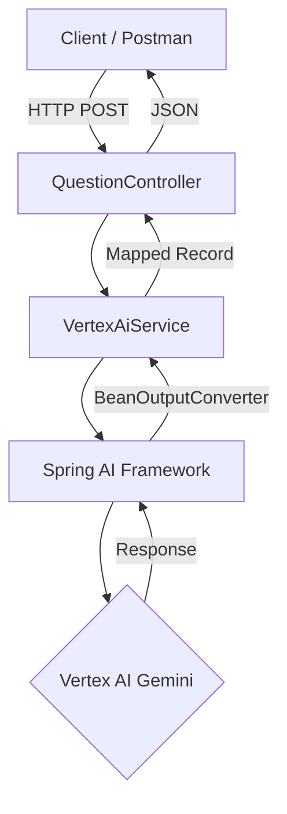

# Spring AI Vertex Gemini Integration

Este repositório contém uma aplicação técnica desenvolvida para o estudo e implementação do ecossistema **Spring AI**, utilizando o modelo **Gemini 2.5 Flash** através do **Google Cloud Vertex AI**. O objetivo principal é demonstrar a integração de _Large Language Models_ (LLMs) em aplicações Java modernas, explorando recursos de prompt templating e conversão de saídas estruturadas para objetos Java (POJOs/Records)

## Fluxo da Arquitetura

O diagrama abaixo ilustra o fluxo de requisição da aplicação, desde o cliente até a obtenção da resposta processada pela inteligência artificial:



## Ferramentas e Tecnologias

A aplicação utiliza as versões mais recentes das tecnologias líderes no ecossistema Java:

* **Java 25 LTS**: Versão de longo suporte para a linguagem.
* **Spring Framework 7**: Base da arquitetura da aplicação.
* **Spring Boot 4.1.0-SNAPSHOT**: Facilitador de configuração e execução.
* **Spring AI 2.0.0-M3**: Framework para integração com modelos de IA.
* **Google Vertex AI Gemini**: Modelo fundacional de IA generativa (Gemini 2.5 Flash).
* **Spring Web MVC**: Para criação de endpoints REST.
* **Maven**: Gerenciador de dependências e build.

## Funcionalidades

* **Processamento de Linguagem Natural**: Interface simples para envio de perguntas genéricas ao modelo.
* **Prompt Templating**: Utilização de arquivos `.st` (StringTemplate) para isolar a lógica de prompts do código Java.
* **Saída Estruturada (Structured Output)**: Uso de `BeanOutputConverter` para garantir que o modelo retorne JSON válido, mapeado diretamente para Java Records.
* **Mapeamento de Metadados**: Uso de `@JsonPropertyDescription` para instruir a IA sobre o significado de cada campo no esquema de resposta.

## Configuração e Pré-requisitos

Para executar este projeto, é necessário configurar o acesso ao **Google Cloud Platform (GCP)**.

### Credenciais Google Cloud

1. Crie um projeto no Console do Google Cloud.
2. Ative a API do Vertex AI.
3. Crie uma Service Account com permissões de acesso ao Vertex AI.
4. Gere uma chave JSON para a Service Account e salve-a como `credentials.json` no diretório `src/main/resources/`.

### Propriedades da Aplicação

Certifique-se de que o arquivo `application.yaml` contenha as configurações corretas do seu projeto:

```yaml
spring:
  ai:
    vertex:
      ai:
        gemini:
          project-id: [ PROJECT_ID ]
          location: [ LOCATION ]
          credentials-uri: 'classpath:credentials.json'
          chat:
            options:
              model: gemini-2.5-flash
          transport: REST
```

## Utilização

Abaixo estão os exemplos de chamadas para os endpoints disponíveis na aplicação.

### 1. Pergunta Genérica

Envia uma pergunta aberta para o modelo de IA.

**Endpoint:** `POST /ask`

**cURL:**

```bash
curl --location 'http://localhost:8080/ask' \
--header 'Content-Type: application/json' \
--data '{
    "question": "Qual a importância de frameworks de IA para desenvolvedores Java?"
}'
```

### 2. Consulta de Capital (Simples)

Retorna o nome da capital de um estado ou país específico.

**Endpoint:** `POST /capital`

**cURL:**

```bash
curl --location 'http://localhost:8080/capital' \
--header 'Content-Type: application/json' \
--data '{
    "stateOrCountry": "Florida"
}'
```

### 3. Consulta de Capital com Informações Detalhadas

Utiliza o `BeanOutputConverter` para retornar um objeto detalhado com população, região, idioma e moeda.

**Endpoint:** `POST /capitalWithInfo`

**cURL:**

```bash
curl --location 'http://localhost:8080/capitalWithInfo' \
--header 'Content-Type: application/json' \
--data '{
    "stateOrCountry": "Brasil"
}'
```

**Exemplo de Resposta:**

```json
{
  "city": "Brasília",
  "population": "Approximately 3.1 million",
  "region": "Federal District, Central-West Region",
  "language": "Portuguese",
  "currency": "Brazilian Real"
}
```

## Estrutura de Prompts

O projeto utiliza o conceito de separação de responsabilidades para os prompts, localizados em`src/main/resources/templates/`:

* `get-capital-prompt.st`: Define a estrutura básica para perguntas sobre capitais.
* `get-capital-with-info.st`: Define um sistema rigoroso de instruções para que a IA retorne exclusivamente um objeto JSON sem explicações adicionais ou marcações de markdown.

## Observações Técnicas

* **REST Client**: A aplicação está configurada para utilizar transporte REST para comunicação com o Vertex AI.
* **Snapshot**: O projeto utiliza versões SNAPSHOT do Spring Boot, o que requer a configuração do repositório de snapshots do Spring no `pom.xml`.
* **Imutabilidade**: Todas as transferências de dados entre camadas são realizadas utilizando Java Records, garantindo imutabilidade e concisão de código.

---

<h2>Juliane Maran</h2>

<p>
  Software Architecture & Development
</p>

---

_Este é um projeto experimental focado em explorar as fronteiras da IA generativa com tecnologias Java de ponta._