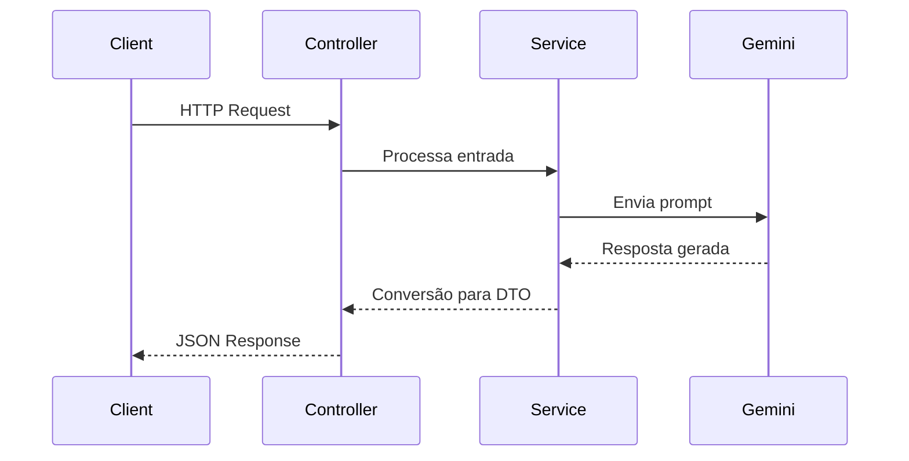
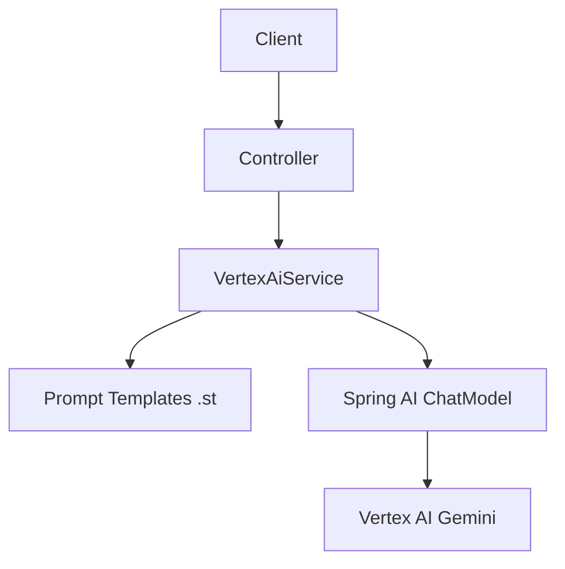

# 🤖 Spring AI Vertex - Gemini (Google Cloud)


## 📌 Descrição

O **Spring AI Vertex** é uma aplicação de exemplo que demonstra a integração entre **Spring AI** e o **Google Vertex
AI (Gemini)**.

O projeto foi desenvolvido com foco educacional e prático, com o objetivo de mostrar como:

- Integrar aplicações Spring com modelos Gemini
- Utilizar prompts dinâmicos com templates
- Converter respostas da IA em objetos Java tipados
- Trabalhar com respostas estruturadas em JSON

## 🚀 Funcionalidades

- 🤖 Integração com **Google Vertex AI (Gemini)**
- 🧠 Geração de respostas baseadas em IA
- 🌍 Consulta de capitais de países/estados
- 📊 Retorno estruturado com informações completas:
    - Cidade
    - População
    - Região
    - Idioma
    - Moeda
- 🔄 Conversão automática de resposta para DTOs
- 🧩 Uso de templates `.st` para prompts reutilizáveis
- 📦 Collection Postman disponível para testes

## 📋 Pré-requisitos

Antes de executar o projeto, você precisa:

- ☕ Java 25
- 📦 Maven 3.9+
- ☁️ Conta no Google Cloud
- 🔑 Credenciais do Vertex AI (`credentials.json`)

## ⚙️ Configuração

Coloque o arquivo de credenciais em:

```
src/main/resources/credentials.json
```

Configuração no `application.yaml`:

```yaml
spring:
  ai:
    vertex:
      ai:
        gemini:
          project-id: seu-project-id
          location: us-central1
          credentials-uri: classpath:credentials.json
```

## ⚙️ Instalação

```bash
# Clone o repositório
git clone https://github.com/JuhMaran/spring-ai-vertex.git

# Acesse o projeto
cd spring-ai-vertex

# Compile
mvn clean install

# Execute
mvn spring-boot:run
```

A aplicação estará disponível em:

```
http://localhost:8080
```

## 🧰 Tecnologias Utilizadas

* Java 25
* Spring Boot 4.1 (Snapshot)
* Spring AI
* Google Vertex AI (Gemini)
* Maven

## 🧪 Como Usar

### Fazer pergunta livre

```bash
curl -X POST http://localhost:8080/ask \
-H "Content-Type: application/json" \
-d '{"question": "Qual a capital do Brasil?"}'
```

### Obter capital

```bash
curl -X POST http://localhost:8080/capital \
-H "Content-Type: application/json" \
-d '{"stateOrCountry": "Chile"}'
```

### Obter capital com informações completas

```bash
curl -X POST http://localhost:8080/capitalWithInfo \
-H "Content-Type: application/json" \
-d '{"stateOrCountry": "Brasil"}'
```

## 📦 Collection Postman

Uma collection pronta está disponível em:

[Collection](collection)

Ela inclui exemplos de:

* ✔️ Requisições válidas
* ❌ Erros (500)
* 📊 Respostas estruturadas

## 🧠 Fluxo de Funcionamento



## 🏗️ Arquitetura



## ⚠️ Observações

* 🔐 Necessário configurar credenciais do Google Cloud corretamente
* ⚠️ Respostas podem variar conforme o modelo Gemini
* 📡 Dependência de serviço externo (Vertex AI)
* 🧪 Testes dependem de credenciais válidas

## 📌 Status do Projeto

✅ Concluído

## 🤝 Contribuição

Contribuições são bem-vindas! 💡

1. Fork do projeto
2. Crie uma branch:

    ```bash
    git checkout -b minha-feature
    ```

3. Commit:

    ```bash
    git commit -m "feat: nova funcionalidade"
    ```

4. Push:

    ```bash
    git push origin minha-feature
    ```

5. Abra um Pull Request

## ♿ Acessibilidade

* Diagramas feitos com **Mermaid** (compatível com GitHub)
* Estrutura com headings claros e organizados
* Uso moderado de emojis para melhor leitura
* Exemplos práticos com cURL e Postman

## 📄 Licença

Este projeto não possui licença definida no momento.

## 👩‍💻 Autora

Desenvolvido por **Juh Maran**  
🔗 [https://github.com/JuhMaran](https://github.com/JuhMaran)
